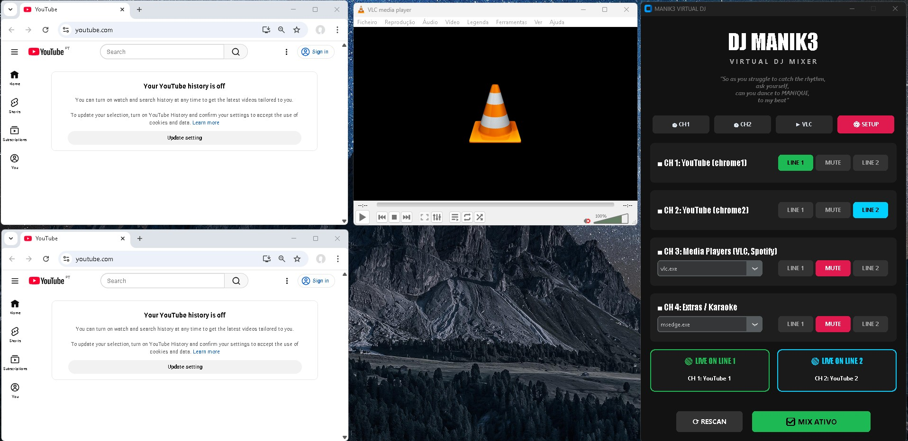

# 🎛️ MANIK3 Virtual DJ & Audio Routing Matrix


A graphical audio routing matrix and state manager designed to dynamically intercept and route process-specific audio to dedicated hardware output lines on Windows. 

Built for live DJing and Karaoke environments, this tool eliminates the need to navigate clunky Windows audio settings by providing a tactile, 4-channel hardware-style mixer interface to route browsers, media players, and extra applications on the fly.

 


## 🚀 Key Features

* **Dynamic Audio Routing:** Utilizes underlying Windows APIs (via SoundVolumeView) to force specific application PIDs to output to designated sound cards (LINE 1 or LINE 2).
* **State Management & Anti-Collision:** Includes built-in logic to prevent audio collisions (e.g., preventing Chrome 1 and Chrome 2 from outputting to the same channel simultaneously), reverting to the last known safe state automatically.
* **Live Process Hooking:** Scans the Windows task list in real-time to detect active media processes (VLC, Spotify, PiKaraoke, Edge) and populates them into the mixer matrix.
* **Integrated Launchpad:** Launches configured applications with specific arguments directly from the UI (e.g., launching isolated Chrome profiles).
* **God Mode (Auto-Admin):** Automatically requests and elevates to Windows Administrator privileges upon launch to ensure seamless registry and audio state modifications.
* **Live Monitoring:** Visual displays that track exactly which applications are actively broadcasting to which physical hardware lines.

## 🧠 Architecture & Tech Stack

* **Frontend:** Built with `customtkinter` for a modern, dark-themed, and responsive UI.
* **Backend Logic:** Python `subprocess` and `ctypes` for executing shell commands, reading Tasklist CSV outputs, and interacting with the Windows Shell.
* **Audio Engine Broker:** Interfaces with NirSoft's `SoundVolumeView` CLI to execute `/SetAppDefault`, `/Mute`, and `/Unmute` commands silently in the background (`NO_WINDOW` flag).

## 🛠️ Prerequisites & Installation

1. **Operating System:** Windows 10/11 (Required for the specific audio API hooks).
2. **Python Dependencies:**
   ```bash
   pip install -r requirements.txt
   ```
   *(Or manually via `pip install customtkinter`)*

3. **SoundVolumeView Engine:**
   * Download [SoundVolumeView by NirSoft](https://www.nirsoft.net/utils/sound_volume_view.html).
   * Extract the ZIP and place `SoundVolumeView.exe` directly in the root directory of this project.

4. **Portable Applications (The Launchpad):**
   The integrated Launchpad relies on isolated portable applications to ensure audio streams can be routed independently without interfering with your main desktop browser. Download the necessary portable apps here:
   * [Google Chrome Portable](https://portableapps.com/apps/internet/google_chrome_portable)
   * [VLC Media Player Portable](https://portableapps.com/apps/music_video/vlc_portable)

5. **Application Folder Structure:**
   Once downloaded, extract them into an `apps/` subdirectory within this project. To create two independent Chrome profiles for CH1 and CH2, install Chrome Portable twice into separate folders and rename the executables. Your final structure must look exactly like this:
   * `/apps/Chrome1/App/Chrome-bin/chrome1.exe` *(Note: renamed from chrome.exe)*
   * `/apps/Chrome2/App/Chrome-bin/chrome2.exe` *(Note: renamed from chrome.exe)*
   * `/apps/VLC/VLCPortable.exe`

## 🕹️ Usage

Run the Python script directly, or compile it into an executable using PyInstaller. 

```bash
python mk3_mix_gui.py
```

1. **Setup:** Click the `⚙️ SETUP` button to map your physical/virtual audio devices to **LINE 1** and **LINE 2**.
2. **Launch:** Use the top Launchpad to open your isolated media applications.
3. **Mix:** Use the 4-channel matrix to seamlessly route or MUTE applications on the fly. The UI will glow Green for Line 1, Cyan for Line 2, and Red for Mute.
4. **Apply:** Click `▶ APPLY MIX` to execute the shell commands and lock in the audio routing.

## ⚠️ Disclaimer
This application modifies Windows default audio endpoints on a per-application basis. Ensure you have the correct audio drivers installed and that applications are currently outputting audio (unmuted in the Windows volume mixer) for the hooks to latch onto them successfully.