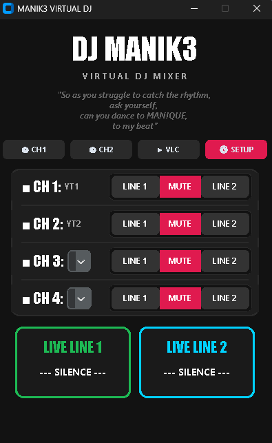
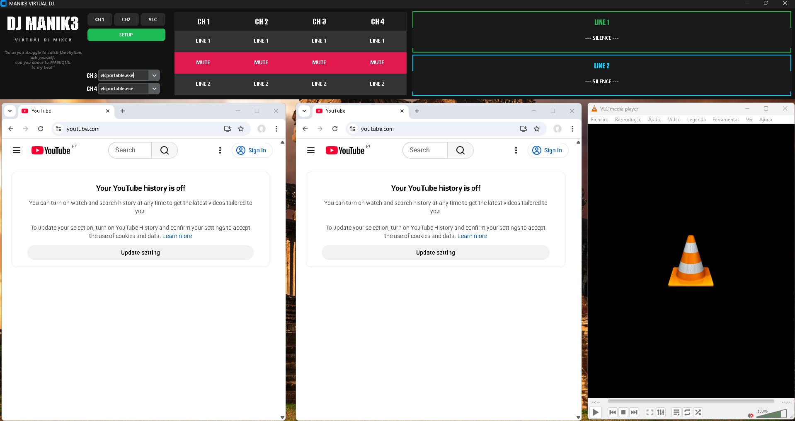
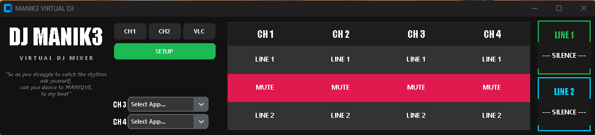

# 🎛️ MANIK3 Virtual DJ & Audio Routing Matrix


A graphical audio routing matrix and state manager designed to dynamically intercept and route process-specific audio to dedicated hardware output lines on Windows. 

Built for live DJing and Karaoke environments, this tool eliminates the need to navigate clunky Windows audio settings by providing a tactile, 4-channel hardware-style mixer interface to route browsers, media players, and extra applications on the fly.

v1.0.0
 

v1.2.0

 

v1.3.0

 
 


## 🚀 Key Features

* **Dynamic Audio Routing:** Utilizes underlying Windows APIs (via SoundVolumeView) to force specific application PIDs to output to designated sound cards (LINE 1 or LINE 2).
* **State Management & Anti-Collision:** Includes built-in logic to prevent audio collisions (e.g., preventing Chrome 1 and Chrome 2 from outputting to the same channel simultaneously), reverting to the last known safe state automatically.
* **Auto-Setup Wizard:** A built-in dependency manager that automatically detects missing environments, connects to GitHub Releases, and safely downloads/extracts isolated portable apps without user intervention.
* **Live Process Hooking:** Scans the Windows task list in real-time to detect active media processes (VLC, Spotify, PiKaraoke, Edge) and populates them into the mixer matrix.
* **Integrated Launchpad:** Launches configured applications with specific isolation arguments directly from the UI (e.g., launching separate, clean Chrome profiles).
* **God Mode (Auto-Admin):** Automatically requests and elevates to Windows Administrator privileges upon launch to ensure seamless registry and audio state modifications.
* **Live Monitoring:** Visual displays that track exactly which applications are actively broadcasting to which physical hardware lines.

## 🧠 Architecture & Tech Stack

* **Frontend:** Built with `customtkinter` for a modern, dark-themed, and responsive UI.
* **Backend Logic:** Python `subprocess` and `ctypes` for executing shell commands, routing `stdout/stderr` streams, and interacting with the Windows Shell.
* **Audio Engine Broker:** Interfaces with NirSoft's `SoundVolumeView` CLI to execute `/SetAppDefault`, `/Mute`, and `/Unmute` commands silently in the background.
* **CI/CD Pipeline:** Fully automated GitHub Actions workflow that compiles the standalone executable via `PyInstaller` and pushes to GitHub Releases upon version tagging.

## 🛠️ Installation & Setup

Thanks to the integrated Auto-Setup Wizard, installing MANIK3 is entirely automated.

### Option 1: Quick Start (Pre-compiled Release)
If you just want to use the application without installing Python, use the standalone package:
1. Go to the [**Latest Release**](https://github.com/dmanique/manik3-virtual-dj/releases/latest) page on GitHub.
2. Download the `MANIK3_Virtual_DJ_Windows.zip` file from the assets list.
3. Extract the `.zip` file into a dedicated folder on your computer.
4. Open the extracted folder and double-click `MANIK3_Mixer.exe`.
5. **The Auto-Setup Wizard** will automatically launch, connect to the cloud, download the NirSoft Audio Engine and the required Portable Applications (Chrome & VLC), and build your workspace in seconds.

### Option 2: Developer Setup (Run from Source)
1. **Operating System:** Windows 10/11 (Required for the specific audio API hooks).
2. **Install Python:** Ensure Python 3.x is installed and added to your system PATH.
3. **Install Dependencies:**
   Open your Command Prompt (cmd), navigate to this project folder, and run:
   ```bash
   pip install -r requirements.txt
   ```
4. **Run the Matrix:**
   ```bash
   python mk3_mix_gui.py
   ```
   *(Note: The Auto-Setup Wizard will automatically fetch and extract the `apps/` directory and `SoundVolumeView.exe` on your first run).*

## 🕹️ Usage

1. **Setup:** Click the `⚙️ SETUP` button to map your physical/virtual audio devices to **LINE 1** and **LINE 2**.
2. **Launch:** Use the top Launchpad to open your isolated media applications. (Chrome 1 and Chrome 2 use strictly isolated user profiles to prevent data collision).
3. **Mix:** Use the 4-channel matrix to seamlessly route or MUTE applications on the fly. The UI will glow Green for Line 1, Cyan for Line 2, and Red for Mute.
4. **Apply:** Click `▶ APPLY MIX` to execute the shell commands and lock in the audio routing.

## ⚠️ Disclaimer
This application modifies Windows default audio endpoints on a per-application basis. Ensure you have the correct audio drivers installed and that applications are currently outputting audio (unmuted in the Windows volume mixer) for the hooks to latch onto them successfully.

## ⚖️ Acknowledgements & Licensing
This project utilizes [SoundVolumeView](https://www.nirsoft.net/utils/sound_volume_view.html) created by Nir Sofer (NirSoft) as the core audio manipulation engine. SoundVolumeView is distributed as freeware and is included in this repository under the terms of the NirSoft freeware distribution license.
